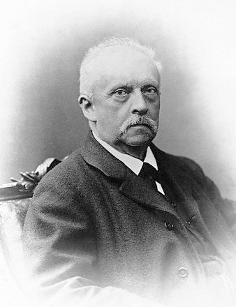

# Kognitywistyka?

---

# Kognitywistyka?

Interdisciplinary, scientific study of the mind and its processes. It examines the nature, the tasks, and the functions of cognition (...). Cognitive scientists study intelligence and behavior, with a focus on how nervous systems represent, process, and transform information. 

Wikipedia, _Cognitive science_

---

# Kognitywistyka?

Mental faculties of concern to cognitive scientists include language, perception, memory, attention, reasoning, and emotion; to understand these faculties, cognitive scientists borrow from fields such as linguistics, psychology, artificial intelligence, philosophy, neuroscience, and anthropology. 

Wikipedia, _Cognitive science_

---

# Kognitywistyka?

The typical analysis of cognitive science spans many levels of organization, from learning and decision to logic and planning; from neural circuitry to modular brain organization. 

Wikipedia, _Cognitive science_

---

# Kognitywistyka?

The fundamental concept of cognitive science is that "thinking can best be understood in terms of representational structures in the mind and computational procedures that operate on those structures."

Wikipedia, _Cognitive science_

---

# Poziomy wyjaśnień w kognitywistyce (Marr)

1. Poziom obliczeniowy (_computational level_): **co** system robi? Jakie problemy rozwiązuje? **Po co**?
2. Poziom algorytmiczny (_algorithmic/representational level_): **jak** system robi to co robi? Jakich **reprezentacji** używa? W jaki sposób?
3. Poziom implementacji (_implementational/physical level_): w jaki sposób algorytmy są **zaimplementowane** w systemie biologicznym?

---

# Kognitywistyka słyszenia?

- _Cognitive science of audition_
- _Auditory cognition_
- _Auditory perception_

---

# Percepcja

---

# Percepcja

* Czym jest percepcja?
* Po co jest percepcja? Co jest jej celem?
* Co daje percepcja?

---

# Teorie percepcji

* Teorie konstruktywistyczne
* Teorie bezpośrednie
* Teorie obliczeniowe
* Przetwarzanie predykcyjne

---

# Teorie konstruktywistyczne (constructive perception)

---

# Teorie konstruktywistyczne (constructive perception)

* Hermann von Helmholtz (1821 - 1894)
* Percepcja to wnioskowanie (_inference_) na temat rzeczywistości
* Percepcja to testowanie hipotez na temat rzeczywistości (Richard Gregory)
* W rozwinięciu to wnioskowanie może być probabilistyczne

---

# Teorie konstruktywistyczne

* Człowiek **konstruuje** obraz rzeczywistości na podstawie **ograniczonych** informacji z narządów percepcji
* Proces top-down
* Czasem inferencje są nieprawidłowe - iluzje

---

# Teorie bezpośrednie (direct perception)

* James Gibson
* Informacje, które docierają do człowieka są **bardzo bogate**
* Nie ma więc potrzeby konstruować rzeczywistości (jest ona dana "na talerzu")
* Percepcja nie jest po to, aby spostrzegać świat. Jest po to, aby organizować i umożliwiać **działanie** (action).
* Nie ma potrzeby angażować **świadomości** w wyjaśnianiu percepcji

---

# Affordances (J.J. Gibson)

The affordances of the environment are what it offers the animal, what it provides or furnishes, either for good or ill. The verb to afford is found in the dictionary, the noun affordance is not. I have made it up. I mean by it something that refers to both the environment and the animal in a way that no existing term does. It implies the complementarity of the animal and the environment.

— Gibson (1979)

---

# Teorie obliczeniowe

* David Marr
* Percepcja to **przetwarzanie informacji napływających z narządów**
* Możemy dowiedzieć się czegoś o ludzkiej percepcji, jeśli stworzymy sztuczne systemy wykonujące podobne działania
* Kluczowe pojęcie **reprezentacji poznawczych** (coś jak zmienne w programowaniu), jako "jednostek" przetwarzania informacji 

---

# Praca domowa

 Przeczytaj:
- <https://medium.com/@solopchuk/intuitions-on-predictive-coding-and-the-free-energy-principle-3fc5bcedc754>
- <https://medium.com/@solopchuk/tutorial-on-active-inference-30edcf50f5dc>