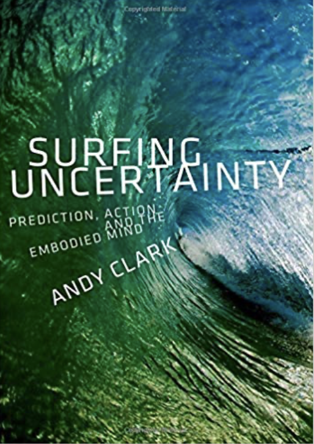

# Predictive processing

---

# Układanka

* Ewolucjonizm
* 3E Cognition
* Allostaza i procesy fizjologiczne
* Inferencja Bayesowska
* Przetwarzanie predykcyjne

---

# 3E Cognition

* **E**mbodied
* **E**nactive
* **E**xtended

---

# Embodied cognition (ucieleśnione poznanie)

* Człowiek poznaje świat całym ciałem, nie tylko układem nerwowym
* Praca układu nerwowego jest nierozerwalnie złączona z ciałem
* Mózg jest zamknięty w czarnej skrzynce, jego interakcje ze światem zależne są od ciała

---

# Enactive cognition (enaktywne poznanie)

* Działanie jest nierozerwalnie związane z poznaniem
* Podmiot poznający zawsze działa, porusza się w świecie, aktywnie pozyskując informacje
* Percepcja jest w dużej mierze zależna od ciała i jego ruchu
* Postrzegamy obiekty w kategoriach działań, które możemy na nich wykonać (affordances, Gibson)
* Pojęcia powstają w kontekście działania

---

# Extended cognition (rozszerzone poznanie)

---

# Extended cognition (rozszerzone poznanie)

* Andy Clark i David Chalmers (1998)
* Jakaś część naszego systemu poznawczego jest całkowicie poza naszym ciałem
* Książki, notesy, komputery, smartfony
* Wikipedia?
* Być może poznanie jest "partnerstwem" pomiędzy mózgiem i światem zewnętrznym?

---

# Homeostaza i allostaza

> Na podstawie: Peter Sterling (2004), _Principles of Allostasis: Optimal Design, Predictive Regulation, Patophysiology and Rational Therapeutics_. W: Allostasis, Homeostasis, and the Costs of Physiological Adaptation. Jay Schulkin (Ed.). Cambridge University Press.

---

# Homeostaza

* Claude Bernard, Walter Cannon, przełom XIX i XX w.
* Celem fizjologii jest utrzymywanie stałych warunków wewnątrz organizmu
* Optymalna temperatura, ciśnienie krwi, stężenie glukozy, gospodarka sodowo-potasowa itd.
* Zachwianie homeostazy powoduje uruchomienie sprzężeń zwrotnych 

---

# Problem z homeostazą

---

# Ciśnienie krwi

* 110/70 to nie poziom optymalny tylko **średni**
* Odzwierciedla poziom najczęstszy ale nie najbardziej optymalny
* Większe zapotrzebowanie na tlen (np. z powodu wysiłku) wymaga wyższego ciśnienia

---

# Allostaza

* Celem fizjologii nie jest zachowanie stałych parametrów tylko zwiększenie szansy na sukces reprodukcyjny
* Parametry fizjologiczne fluktuują, ale nie z powodu zachwiania homeostazy
* Fluktuacje służą optymalizacji
* Allostaza: **coordinated variation to optimize performance at the least cost** (Sterling, 2004)

---
 
# Zasady allostazy

1. Organizmy są wydajne
2. Wydajność wymaga wzajemnych "poświęceń" (_reciprocal trade-offs_)
3. Wydajność wymaga przewidywania potrzeb
4. Przewidywanie wymaga dostrojenia sensorów do spodziewanych bodźców
5. Przewidywanie wymaga dostrojenia efektorów do spodziewanego zapotrzebowania
6. Regulacja predyktywna zależy od zachowania, które również podlega adaptacji

---

# Organizmy są wydajne

* Systemy fizjologiczne muszą być wydajne aby dobrze działać w większości prawdopodobnych sytuacji
* Zbyt duża wydajność (odporność na bardzo nieprawdopodobne, ekstremalne warunki) powoduje za duże koszty utrzymania
* Zbyt mała wydajność (brak odporności na prawdopodobne zdarzenia) jest w oczywisty sposób bez sensu

---

# Wydajność wymaga wzajemnych poświęceń

* _Reciprocal trade-offs_
* Poszczególne systemy/organy mogą dzielić się zasobami
* W czasie spoczynku zapotrzebowanie mięśni szkieletowych na krew to 1,2 l/min
* W czasie 100% wysiłku rośnie do 22l/min
* Nerki chwilowo dostają mniej krwi, żeby zaspokoić zapotrzebowanie mięśni
* To wymaga **centralnego sterowania**!

---

# Wydajność wymaga przewidywania potrzeb

* Reagowanie na zachwiania równowagi jest niewystarczające i zbyt kosztowne
* Optymalnie jest **przewidywać** potrzeby i reagować na nie
* Osoba z cukrzycą zrobi sobie zastrzyk z insuliny **przed** posiłkiem
* Naczelną funkcją mózgu jest **przewidywanie przyszłych stanów** w celu optymalizacji metabolicznej

---

# Inferencja Bayesowska

# Zagadka

* Spotykasz studenta na kampusie, zaczynacie rozmawiać
* Okazuje się, że nazywa się Tomek i jest bardzo nieśmiały
* Co robi Tomek? 
* Studiuje prawo?
* Robi dr z matematyki?

---

# Zagadka

* Ile jest **w ogóle** studentów prawa na kampusie?
* Ile jest **w ogóle** ludzi robiących phd z matmy na kampusie?

---

# Inferencja Bayesowska

> Posterior ~ Prior * Likelihood 

---

# Inferencja Bayesowska

---

# Bayesian Brain Hypothesis

* W wielu zadaniach ludzki system poznawczy zachowuje się bayesowsko
* Być może inferencja bayesowska jest implementowana w układzie nerwowym
* _Free energy principle - every living organism aims to maximize the bayesian model evidence_ (Friston)

---

# PP

* Predictive processing (przetwarzanie predykcyjne)
* Predictive coding (kodowanie predykcyjne)
* Active inference (aktywne wnioskowanie)

---

# Herman von Helmholtz (1821 - 1894)

---

# Karl Friston

---

# Model wewnętrzny (internal model)

- Zasada cybernetyczna: wszystko, co reguluje dany system musi utrzymywać **wewnętrzny model** tego systemu
- Zasadniczym zadaniem mózgu jest zachowanie allostazy organizmu
- Mózg ciągle modeluje stan wewnętrzny ciała (_interocepcja_) i to, jak ciało ma się od otoczenia (_percepcja_) 

---

# PP - o co chodzi?

Percepcja jest kombinacją:

- **Predykcji** opartych na wiedzy
- Danych sensorycznych potwierdzających (lub nie) te predykcje

---

# PP - o co chodzi?

Percepcja jest kombinacją:

- procesów **zstępujących** (top-down)
- procesów **wstępujących** (bottom-up)

---

# Percepcja to kontrolowana halucynacja

* Wykorzystujemy probabilistyczną wiedzę, żeby tworzyć **generatywny model świata**
* Model ten wykorzystujemy do **konstruowania** doświadczeń percepcyjnych

---

# Mózg jako maszyna do tworzenia predykcji

* Mózg nie jest pasywnym "odbieraczem i analizatorem bodźców"
* Mózg to wielowarstwowe, wieloośrodkowe, hierarchiczne urządzenie, które non-stop zajmuje się **przewidywaniem własnych stanów sensorycznych** (eksterocepcji i interocepcji)
* **Hierarchiczne**, ponieważ _wyższe_ struktury cały czas starają się przewidzieć stany _niższych_ struktur

---

# Błędy predykcji (prediction errors)

* Jeśli stany sensoryczne zgodne są z modelem/przewidywaniami: wszystko jest ok
* Jeśli nie: powstają błędy predykcji, które uaktualniają model tak, by lepiej przewidywał stany
* To jest **uczenie się**

---

# Precyzja

* _Self-estimated sensory uncertainty - precision_
* Błędy predykcji mogą wynikać z różnych przyczyn
* W nocy widzimy mniej niż w dzień
* Mózg zdaje sobie sprawę z niepewności związanej z błędami predykcji
* Im większa niepewność/mniejsza precyzja, tym błędy mają mniejszą szansę wpłynąć na model generatywny

---

---

# Precyzja a uwaga

- W PP ten mechanizm utożsamiany jest z **uwagą**
- Jeśli kierujemy na coś uwagę, zwiększamy precyzję błędów predykcji
- Zwiększając precyzję, zwiększamy szansę na zmianę modelu świata

---

# PP to nie tylko percepcja

- PP sugeruje, że tworzenie modeli jest naczelną zasadą organizującą systemy biologiczne!
- W tym sensie aplikowane jest do wszystkich obszarów funkcjonowania umysłu

---

# PP to nie tylko teoria! 

- PP to zasada, wg. której skonstruowane są układy nerwowe!
- Mózgi ssaków mają architekturę, która pozwala na PP (mają?)

---

# Predykcje w życiu

200km/h!

---

# Proste przykłady

---

# Proste przykłady

<https://michaelbach.de/ot/mot-flashLag/index.html>

---

# PP a działanie

Gdy model się nie zgadza z danymi sensorycznymi, można:

* Zmienić model, by pasował do świata
* Zmienić świat, by pasował do modelu

---

# PP a poruszanie się (motor control)

* Gdy chce się poruszyć, wytwarzam model świata, w którym już się poruszyłem
* Model odbiega od rzeczywistości (błędy predykcji!)
* Ruszam się, żeby dopasować model (zmniejszyć błąd)
* (można tak programować roboty!)

---

# Ale po co w ogóle się ruszać?

* PP zakłada hierarchiczność systemu
* Pragnienia "długoterminowe" (motywacje?) są wynikami długoterminowych, wysokopoziomowych predykcji na temat własnego stanu w przyszłości

---

# Przykład (A.Clark)

* _Przwiduję, że_ spotkamy się o 19:00 w kinie, więc...
* _Przwiduję, że_ wsiądę do autobusu o 18:30, więc...
* _Przwiduję, że_ poruszę moimi kończynami, żeby dojść na przystanek, itd.

---

# Od PP do free energy principle

---

# Problemy z PP

* Teoria wszystkiego?
* Falsyfikowalność?
* Czy PP to wszystko, czy jest coś jeszcze?
* Czy PP tłumaczy celowość, moralność, inne ludzkie przywary?
* Czy free energy principle się zgadza?

---

# Jeśli kogoś to zainteresowało...

[Anil Seth: Your brain hallucinates your conscious reality](https://www.youtube.com/watch?v=lyu7v7nWzfo)

[Andy Clark: Happily Entangled: Emotions Cognition and the Predictive Mind](https://www.youtube.com/watch?v=OS3RM3F8YmE)

---

# Książki o PP

Jakob Hohwy, The Predictive Mind (2014), Oxford University Press

---

# Książki o PP

