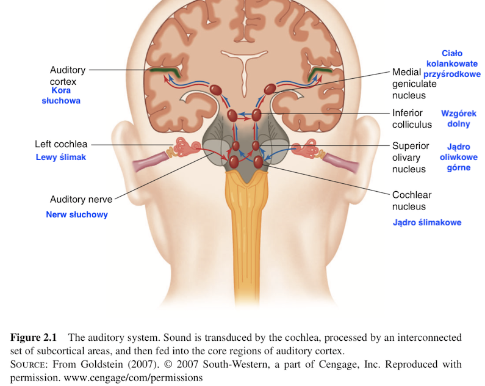

## Analogia Bregmana

Wyobraź sobie, że jesteś nad jeziorem i twój kolega chce zagrać z tobą w grę. Gra polega na tym: wykopiecie dwa wąskie "kanały" idące z jeziora w głąb lądu. Wystarczy, żeby kanały miały metr długości, kilkanaście centymetrów szerokości i były od siebie odległe o jakieś pół metra. W połowie każdego z tych kanałów rozciągniecie prostokątny kawałek tkaniny i przymocujecie do ścian waszych kanałów. Gdy na jeziorze powstają fale, wpływają do waszych kanałów i powodują ruch tkaniny.

## Analogia Bregmana

## Na czym polega gra?

Twoim zadaniem jest patrzeć **tylko na ruch tkaniny** i odpowiedzieć na serię pytań:

- Ile łódek pływa po jeziorze?
- Gdzie są te łódki?
- Która z łódek ma największy silnik?
- Która jest najbliżej ciebie?
- Czy wieje wiatr?
- Czy ktoś nagle wrzucił do jeziora jakiś duży obiekt?

## ?

- Rozwiązanie tego problemu wydaje się niemożliwe
- Jest to **ścisła analogia** ludzkiego systemu słuchowego

## System słuchowy

## System słuchowy

## Ślimak i narząd Cortiego

## Charakterystyczne cechy systemu słuchowego

- Selektywność częstotliwości (_frequency selectivity_)
- Kompresja amplitudy (_amplitude compression_)
- _Phase locking_

## Selektywność częstotliwości

- Ślimak to zestaw filtrów środkowoprzepustowych (_band-pass filters_), czułych na wybrane częstotliwości
- Zakresy tych filtrów łącznie dają spektrum słyszanych częstotliwości (20Hz-20 000Hz)
- Zjawisko to nazywa się _tonotopią_
- Im wyższa częstotliwość, tym szerszy zakres filtrów
- Dlatego gorzej różnicujemy wyższe częstotliwości

## Skąd bierze się selektywność częstotliwości?

- Mechanika błony podstawnej (basilar membrane)
- Mechanika komórek rzęsatych
- Kształt ślimaka i mechanika płynu (_perilymph_, przychłonka)

## Selektywność częstotliwości

## Tonotopia w ślimaku

## Kompresja amplitudy

- Aktywacja w odpowiedzi na cichsze dźwięki jest wyższa niż można by sądzić po aktywacji w odpowiedzi na głośniejsze dźwięki
- Ludzki słuch odbiera olbrzymi zakres dynamiki (co najmniej 100dB czyli 5 rzędów wielkości), jednak odpowiedzi ze ślimaka różnicują głośność tylko na 2 rzędach wielkości

## Kompresja amplitudy
- Kompresja pomaga w słyszeniu cichych bodźców, jednocześnie umożliwiając słyszenie zmian w głośności bodźców głośnych
- Kompresja spowodowana jest charakterystyką drgań błon narządu Cortiego i ruchem zewnętrznych komórek rzęsatych
- Często w uszkodzeniu słuchu następuje spadek poziomu kompresji

## Krzywa kompresji (v = 0.3 ^ x)

## Phase locking

- Peak aktywacji neuronów w nerwie słuchowym pokrywa się z peakiem fali akustycznej
- Jeden z dodatkowych mechanizmów rozpoznawania częstotliwości
- _Phase locking_ jest obecny tylko dla częstotliwości < 4kHz
- Akurat powyżej 4kHz zupełnie tracimy zdolność oceny wysokości dźwięku

## Phase locking

## Modulacja amplitudy i obwiednie

## Co to jest obwiednia (envelope)?

## Noise-vocoded speech

## Noise-vocoded speech

## Kora słuchowa

## Wzrastający poziom skomplikowania układu

- 3500 komórek rzęskowych na ucho
- 30000 włókien w nerwie słuchowym
- 60 mln neuronów w pierwszorzędowej korze słuchowej (?)
- 100 mln neuronów w całej korze słuchowej (z jednej strony)

## Kora słuchowa

## Pierwszorzędowa kora słuchowa

- Zakręt Heschla
- Pola Broadmanna 41 i 42
- Jednostronne uszkodzenie - problemy ze słuchem
- Obustronne uszkodzenie - głuchota korowa

## Właściwości pierwszorzędowej kory

- Modulacja spektralna - wykrywanie zmian głośności tylko w obrębie określonych częstotliwości
- Tonotopia

## Tonotopia w korze pierwszorzędowej

