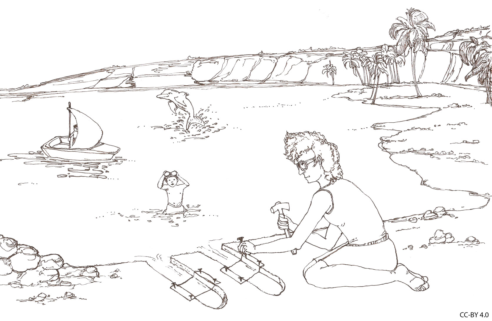

# Fale akustyczne

---

### Czym jest dźwięk?

Przedyskutujcie w grupach. Czym jest dźwięk z perspektywy:
1. Fizycznej
2. Fizjologicznej
3. Psychologicznej

---

# Dźwięk (Wikipedia: Sound)

* W fizyce: wibracje propagowane za pośrednictwem (zwykle słyszalnej) mechanicznej fali ciśnienia, w ośrodku takim jak powietrze lub woda.
* W fizjologii i psychologii: dźwięk to rejestrowanie tych fal i ich percepcja przez mózg.

---

---

# Fale akustyczne

<https://www.sonicvisualiser.org/>

---

# Własności fal akustycznych

* Częstotliwość
* Amplituda
* Prędkość rozchodzenia się

---

# Częstotliwość

* Jednostka - Hertz (Hz)
* 1Hz = jedna oscylacja na sekundę
* Słyszymy częstotliwość (najczęściej) jako **wysokość dźwieku**
* Słyszymy (teoretycznie) częstotliwości pomiędzy 20Hz i 20,000Hz (20kHz)

---

# Amplituda

* Słyszymy amplitudę jako **głośność**
* Energia akustyczna - 
* Miara fizyczna - SPL (sound pressure level)
* Pomiar na skali logarytmicznej – dB (decybel)

---

# Dźwięki w prawdziwym życiu i ich amplitudy

| Dźwięk | Dystans | dB SPL |
|---|---|---|
| Granat hukowy |Ambient |158–172 | 
| Silnik odrzutowy |1 m | 150 |
| Próg bólu | Do ucha | 130-140 |
| Najgłośniejszy głos ludzki | 1 cal | 135 |
| Trąbka | 0.5 m | 130
| Vuvuzela | 1 m | 120 |

---

# Dźwięki w prawdziwym życiu i ich amplitudy

| Dźwięk | Dystans | dB SPL |
|---|---|---|
| Ryzyko natychmiastowej utraty słuchu | Do ucha | 120 |
| Silnik odrzutowy | 100 m | 120 |
| Ruch samochodowy | 10 m | 85 |
| Uszkodzenie słuchu (długoterminowe) | Do ucha | 85 |
| Samochód pasażerski | 10 m | 70 |

---

# Dźwięki w prawdziwym życiu i ich amplitudy

| Dźwięk | Dystans | dB SPL |
|---|---|---|
| TV  | 1 m | 60 |
| Normalna rozmowa | 1 m | 40–60 |
| Bardzo cichy pokój | Ambient | 20–30 |
| Szum liści | Ambient | 10 |
| Próg słyszenia 1kHz | Do ucha | 0 |

---

# Prędkość propagacji

- Powietrze na poziomie morza, 20 st. C. - 343 m/s
- Woda: 1482 m/s
- Stal: 5960 m/s

---

# Analogia Bregmana

Wyobraź sobie, że jesteś nad jeziorem i twój kolega chce zagrać z tobą w grę. Gra polega na tym: wykopiecie dwa wąskie "kanały" idące z jeziora w głąb lądu. Wystarczy, żeby kanały miały metr długości, kilkanaście centymetrów szerokości i były od siebie odległe o jakieś pół metra. W połowie każdego z tych kanałów rozciągniecie prostokątny kawałek tkaniny i przymocujecie do ścian waszych kanałów. Gdy na jeziorze powstają fale, wpływają do waszych kanałów i powodują ruch tkaniny.

---

---

# Na czym polega gra?

Twoim zadaniem jest patrzeć **tylko na ruch tkaniny** i odpowiedzieć na serię pytań:

- Ile łódek pływa po jeziorze?
- Gdzie są te łódki?
- Która z łódek ma największy silnik?
- Która jest najbliżej ciebie?
- Czy wieje wiatr?
- Czy ktoś nagle wrzucił do jeziora jakiś duży obiekt?

---

# ?

- Rozwiązanie tego problemu wydaje się niemożliwe
- Jest to **ścisła analogia** ludzkiego systemu słuchowego