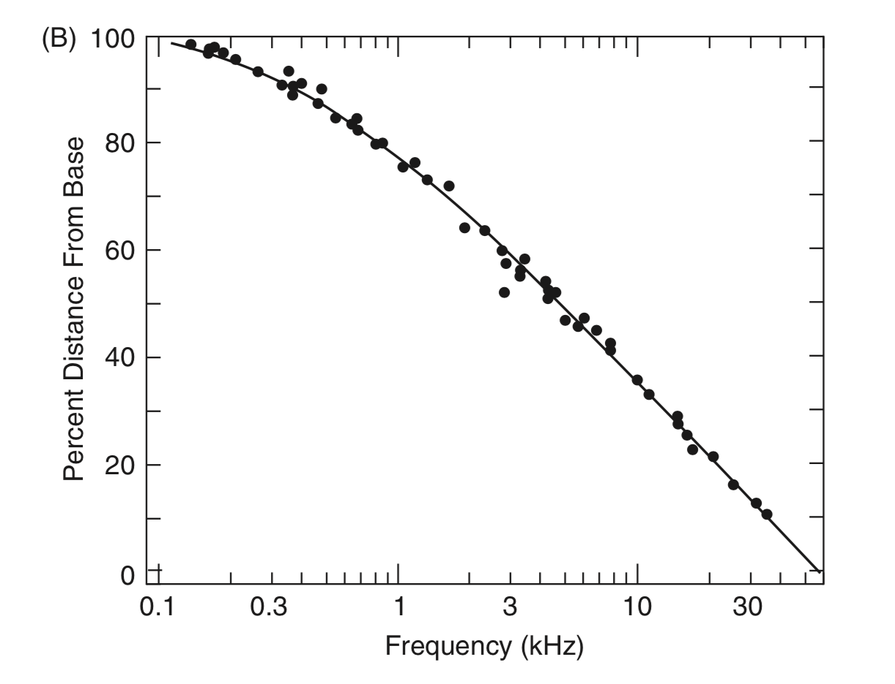
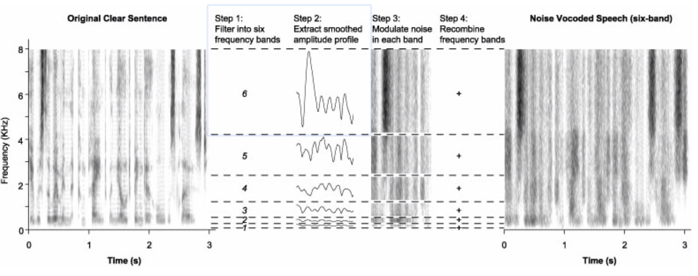
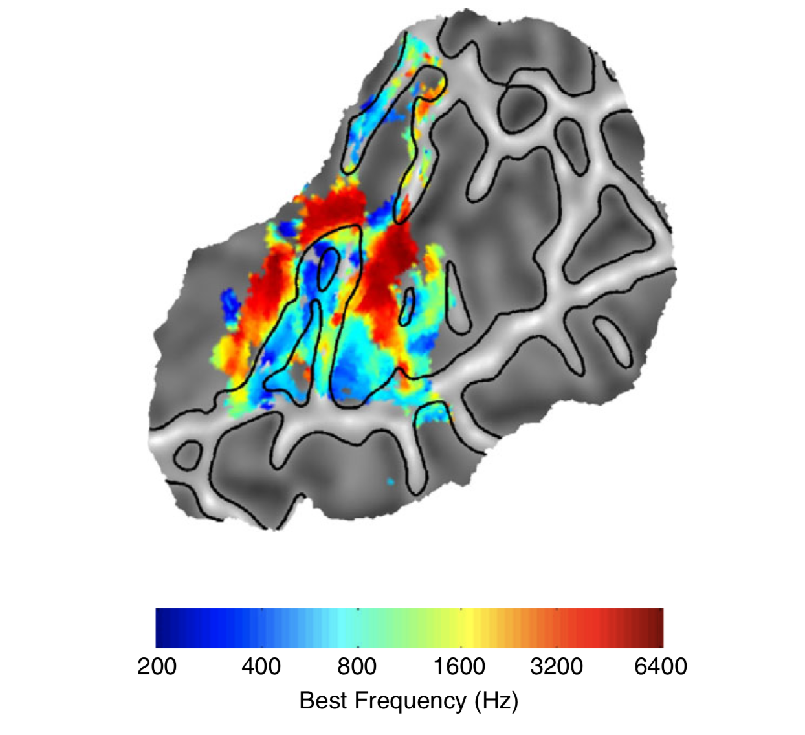

# System słuchowy

---

# System słuchowy

---

# Ślimak i narząd Cortiego

---

# Charakterystyczne cechy systemu słuchowego

- Selektywność częstotliwości (_frequency selectivity_)
- Kompresja amplitudy (_amplitude compression_)
- _Phase locking_

---

# Selektywność częstotliwości

- Ślimak to zestaw filtrów środkowoprzepustowych (_band-pass filters_), czułych na wybrane częstotliwości
- Zakresy tych filtrów łącznie dają spektrum słyszanych częstotliwości (20Hz-20 000Hz)
- Zjawisko to nazywa się _tonotopią_
- Im wyższa częstotliwość, tym szerszy zakres filtrów
- Dlatego gorzej różnicujemy wyższe częstotliwości

---

# Skąd bierze się selektywność częstotliwości?

- Mechanika błony podstawnej (basilar membrane)
- Mechanika komórek rzęsatych
- Kształt ślimaka i mechanika płynu (_perilymph_, przychłonka)

---

# Selektywność częstotliwości

---

# Tonotopia w ślimaku

---

# Kompresja amplitudy

- Aktywacja w odpowiedzi na cichsze dźwięki jest wyższa niż można by sądzić po aktywacji w odpowiedzi na głośniejsze dźwięki
- Ludzki słuch odbiera olbrzymi zakres dynamiki (co najmniej 100dB czyli 5 rzędów wielkości), jednak odpowiedzi ze ślimaka różnicują głośność tylko na 2 rzędach wielkości

---

# Kompresja amplitudy
- Kompresja pomaga w słyszeniu cichych bodźców, jednocześnie umożliwiając słyszenie zmian w głośności bodźców głośnych
- Kompresja spowodowana jest charakterystyką drgań błon narządu Cortiego i ruchem zewnętrznych komórek rzęsatych
- Często w uszkodzeniu słuchu następuje spadek poziomu kompresji

---

# Phase locking

- Peak aktywacji neuronów w nerwie słuchowym pokrywa się z peakiem fali akustycznej
- Jeden z dodatkowych mechanizmów rozpoznawania częstotliwości
- _Phase locking_ jest obecny tylko dla częstotliwości < 4kHz
- Akurat powyżej 4kHz zupełnie tracimy zdolność oceny wysokości dźwięku

---

# Phase locking

---

# Modulacja amplitudy i obwiednie

---

# Co to jest obwiednia (envelope)?

---

# Noise-vocoded speech

---

# Noise-vocoded speech

---

# Kora słuchowa

---

# Wzrastający poziom skomplikowania układu

- 3500 komórek rzęskowych na ucho
- 30000 włókien w nerwie słuchowym
- 60 mln neuronów w pierwszorzędowej korze słuchowej (?)
- 100 mln neuronów w całej korze słuchowej (z jednej strony)

---

# Kora słuchowa

---

# Pierwszorzędowa kora słuchowa

- Zakręt Heschla
- Pola Broadmanna 41 i 42
- Jednostronne uszkodzenie - problemy ze słuchem
- Obustronne uszkodzenie - głuchota korowa

---

# Właściwości pierwszorzędowej kory

- Modulacja spektralna - wykrywanie zmian głośności tylko w obrębie określonych częstotliwości
- Tonotopia

---

# Tonotopia w korze pierwszorzędowej

