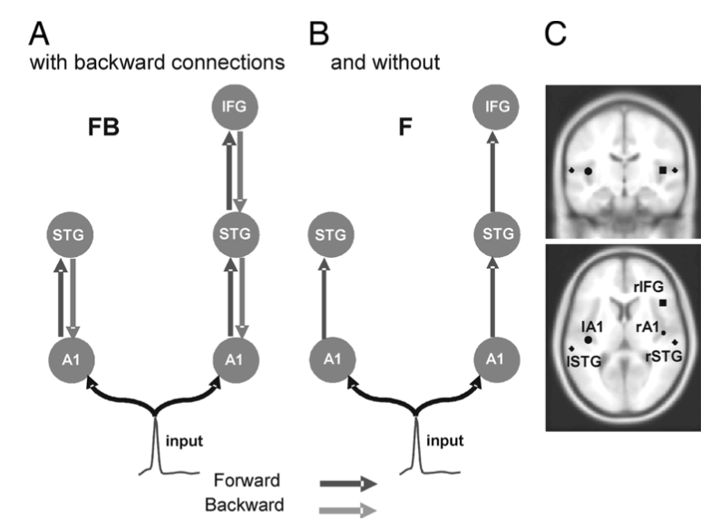

# Percepcja wysokości dźwięku

---

# Wysokość dźwięku

* (Prosty?) korelat częstotliwości fali akustycznej
* Dźwięki mogą być wyższe (wyższe częstotliwości) albo niższe

---

# Do czego wykorzystujemy wysokość dźwięku?

* Melodia w muzyce
* Harmonia w muzyce
* Zmiany wysokości są składnikiem prozodii mowy
* W językach tonalnych (np. języki chińskie), niosą informacje semantyczne

---

# Jak rozpoznajemy wysokość dźwięku?

* Dobre pytanie!
* Prosta (?) sprawa w przypadku harmonicznych tonów złożonych (_harmonic complex tones_)
* Te tony składają się z **tonu podstawowego** (f0) oraz jego wielokrotności

---

# Harmoniczne tony złożone - przykład

* f0 = 200Hz
* Ton = [200, 400, 600, 800, 1000...]
* W muzyce kolejne tony harmoniczne to **alikwoty**
* Amplituda kolejnych tonów stanowi podstawę percepcji **barwy** dźwięku

---

# Harmoniczność

* Stopień, w jakim kolejne tony są podobne do szeregu harmonicznego
* Dźwięki w naturze mają różne stopnie harmoniczności
* Dźwięki harmoniczne: głosy, śpiewy, instrumenty muzyczne
* Dźwięki nieharmoniczne: trzaski, szelesty, itd

---

# Harmoniczność

* Postuluje się istotną rolę harmoniczności w problemie cocktail party (Popham et al. 2018) i w rozpoznawaniu wysokości dźwięku (McPherson i McDermott, 2018)
* System słuchowy wyewoluował, aby rozpoznawać z tła akustycznego bodźce harmoniczne

---

# Missing fundamental phenomenon

<https://www.youtube.com/watch?v=0amvhGzeCnQ>

---

# Jak to się dzieje w mózgu?

* Place theories (filtrowanie w ślimaku i tonotopia)
* Time theories (*phase-locking*)
* Place-time theories

---

# Place theories

* Tonotopia jest "zachowana" w górnych warstwach hierarchii percepcyjnej
* Różne wysokości dźwięku są kodowane w różnych miejscach kory słuchowej
* Nie wyjaśniają zaniku wrażenia wysokości powyżej 4kHz oraz bardzo wysokiej dokładności, z jaką ludzie rozróżniają nawet niewielkie różnice w F0 (przynajmniej w pewnym przedziale)
* Binaural beats - mogą świadczyć o tonotopii na (trochę) wyższych piętrach niż ślimak 

---

# Time theories

* Phase-locking zanika w okolicach 4-6kHz
* Na tym poziomie ludzie przestają rozróżniać wysokości dźwięków w sensie melodii
* Uwaga! Wszystko, co wiemy o phase locking, wiemy z badań na marmozetach i innych małych ssakach. Nie ma żadnej gwarancji, że tak samo jest u ludzi.
* Spora dyskusja w środowisku na temat granicy zanikania phase locking (konsensus: gdzieś pomiędzy 1kHz a 8kHz)

---

# Ograniczenia time theories

* Ludzie świetnie uczą się rozpoznawać wysokość
* Profesjonalni muzycy robią to sześć razy lepiej niż normalni ludzie
* ...ale przeciętnemu Kowalskiemu wystarczy 4-8 godzin treningu, żeby dogonić profesjonalnego muzyka w _pitch discrimination task_

---

---

# Inne dziwne zjawiska percepcyjne

* Jeśli dźwięk jest bardzo głośny, słyszymy go wyżej
* Porównywanie dźwięków różnej barwy jest utrudnione
* Missing fundamental działa dla bardzo wysokich częstotliwości (powyżej 5kHz)
* Ton Sheparda
* Amuzja
* Słuch absolutny

---

# Amuzja (CA)

* Congenital Amusia (CA) - termin określający wystepujące w toku całego życia deficyty muzyczne, których nie można przypisać niepełnosprawności intelektualnej, niewielkim doświadczeniom muzycznym lub uszkodzeniu mózgu.
* Centralny objaw - uogólnione (a nie specyficznie muzyczne) problemy z percepcją wysokości dźwięku (Vuvan et al. 2015)
* Osoby z CA nie rozróżniają dźwięków oddalonych o dwa półtony
* To powoduje, że funkcje językowe są zachowane, jednak kompletnie upośledzona jest zdolność rozpoznawania melodii i słyszenia fałszy
* Często osoby z CA rozpoznają piosenki po słowach (nie po melodii)

---

# Amuzja (CA)

* Prewalencja CA - ok. 1.5% (Peretz, Vuvan, 2017)
* Problem dziedziczny  - ok. 40% spokrewnionych w pierwszej linii również ma CA
* Praktycznie brak zaburzeń współwystępujących, nie licząc problemów z orientacją przestrzenną u ok. 15% amuzyków
* Trening muzyczny nie wpływa na symptomy CA

---

# Potencjały wywołane / czynnościowe (event related potentials, ERP)

---

(Zhang et al., 2017, Sensors)

---

(Garrido et al. 2007, PNAS)

---

(Garrido et al. 2007, PNAS)

---

# Mózg w CA - event related potentials

* Brak różnic z mismatch negativity (MMN) pomiędzy CA a grupą kontrolną
* Niższe amplituda późniejszych ("uwagowych") komponentów P300
* Co to znaczy? Przetwarzanie na niskim poziomie zachowane, problem z wyższymi piętrami hierarchii
* Osoby z CA przetwarzają bodźce słuchowe, ale nie mają świadomego dostępu do ich rezultatów (Peretz, 2016)

---

(Moreau et al., 2013, Brain & Cognition)

---

# Zagadka metafory wysokości dźwięku

Dlaczego na dźwięki i niższej częstotliwości mówimy, że są _niskie_ a na dźwięki o wysokiej częstotliwości, że są _wysokie_?

---

# David Huron o metaforze wysokości dźwięku

<https://vimeo.com/34747210>

---

# Determinizm językowy, hipoteza Sapira-Whorfa

* Nasze myśli i zachowania są kształtowane, przynajmniej do pewnego stopnia, przez język jakiego używamy.
* Determinizm językowy - język **determinuje** nasz sposób myślenia (bardzo kontrowersyjna, silniejsza wersja hipotezy Sapira-Whorfa)

---

# Metafora wysokości dźwięku

* Metafora jest starsza niż odkrycie, że wysokość dźwięku jest powiązana z częstotliwością
* Metafora jest starsza niż zapis nutowy
* Ptaki wydają wysokie dźwięki i siedzą _u góry_, słonie _na dole_...
* Podnosimy głowę śpiewając wysokie dźwięki
* Wiele kontrprzykładów (kobiety/mężczyźni, dorośli/dzieci)

---

# W innych językach mamy inne metafory na wysokość dźwięku

* W większości języków mamy dźwięki wysokie/niskie
* W kilku językach _wysoki_ oznacza dźwięki o niskiej częstotliwości
* W tych kulturach dominującym instrumentem jest instrument, w którym niskie dźwięki są _na górze_ instrumentu
* W indonezyjskim i kilku innych mamy metaforę wielkości - dźwięki duże i małe

---

# Jak to się ma do determinizmu?

* Wydaje się, że w przypadku metafory wysokości dźwięku percepcja zdeterminowała język, a nie na odwrót

---

# Jak przebiega uczenie się lokalizacji wysokości dźwięku? Walker (2010)

* Niewidomi i widzący badani słyszeli dźwięk o opadającej bądź wzrastającej częstotliwości
* _Wyobraź sobie, że masz trochę pieniędzy. Ten dźwięk oddaje to co stało się z twoimi oszczędnościami. Posłuchaj go i powiedz, czy masz teraz więcej czy mniej pieniędzy?_

---

# Jak przebiega uczenie się lokalizacji wysokości dźwięku? Walker (2010)

* Osoby widzące słysząc dźwięk o wzrastającej _f_ mówiły, że mają **więcej pieniędzy**
* Osoby niewidome w większości mówiły, że mają **mniej pieniędzy**
* Część osób niewidomych mówiła, że ma więcej pieniędzy. Były to osoby, które utraciły wzrok w trakcie życia.
* Osoby niewidome od urodzenia mówiły, że mają **mniej**

---

# Dlaczego?

* Niewidomi od urodzenia użyli drugiej metafory wysokości dźwięku
* Duże przestrzenie produkują rezonans w niższych częstotliwościach - dźwięki **duże**
* Małe przestrzenie produkują rezonans w **wyższych** częstotliwościach - dźwięki **małe**

---

# To jak przebiega uczenie się lokalizacji wysokości dźwięku?

* Uczenie się przebiega wskutek wskazówek wzrokowych
* Oczy "kalibrują" uszy
* Niewidomi od urodzenia nie mogą tego zrobić - używają drugiej metafory
