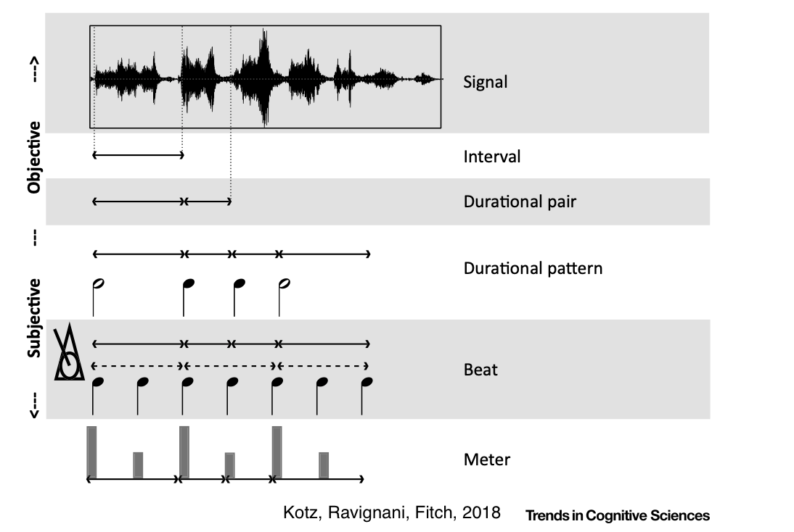

# Rytm

---

# Pojęcia

* Częstotliwość (frequency)
* Faza (phase)
* Izochroniczność (isochronicity)

---

# Jak przetwarzają rytm systemy biologiczne

* Motor periodicity
* Beat extraction
* Audiomotor entrainment
* Meter

---

# Rytm w muzyce

* Muzyka jest zadziwiająco izochroniczna (choć nie zawsze)
* Jest to pewnie potrzebne, żeby grać razem
* _Beat extraction_ czasem jest bardzo trudne (periodyczność jest nieoczywista, niewidoczna w fali akustycznej)
* _Meter_ jest jeszcze trudniejsze i nieoczywiste

---

---

# W mowie

* Dźwięki pojawiają się rytmicznie, ale często nie izochronicznie (częstotliwość przyspiesza i zwalnia)
* Rytm determinuje _akcentowanie_, które jest ważne dla rozumienia mowy