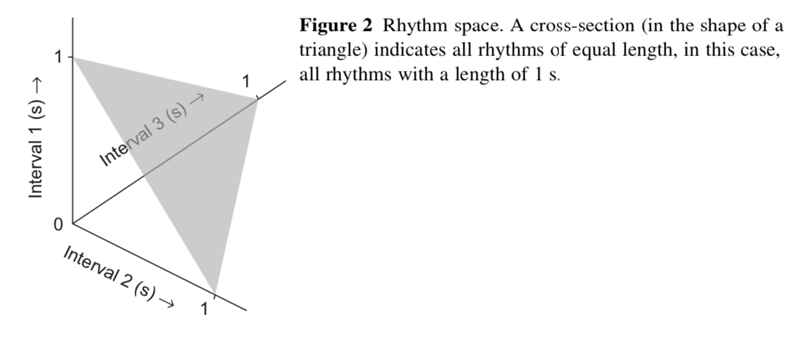
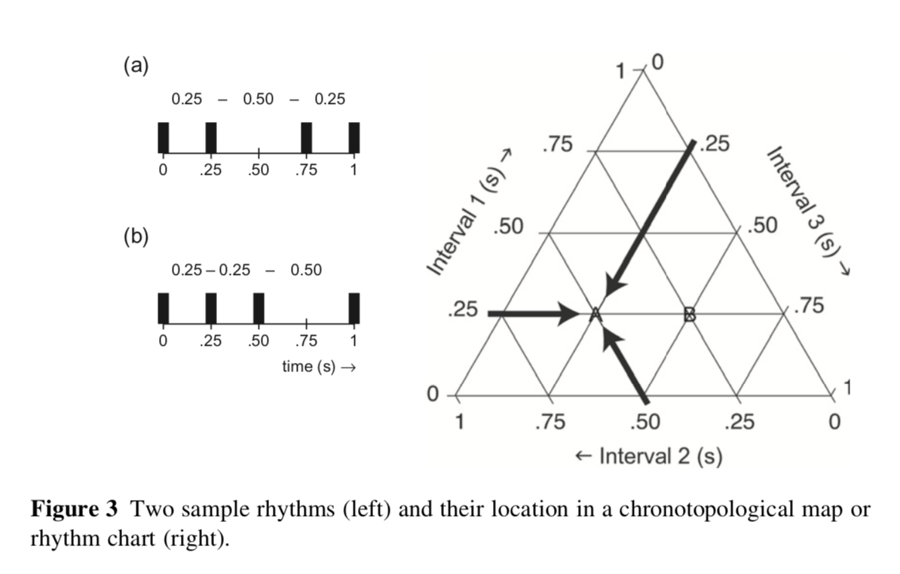
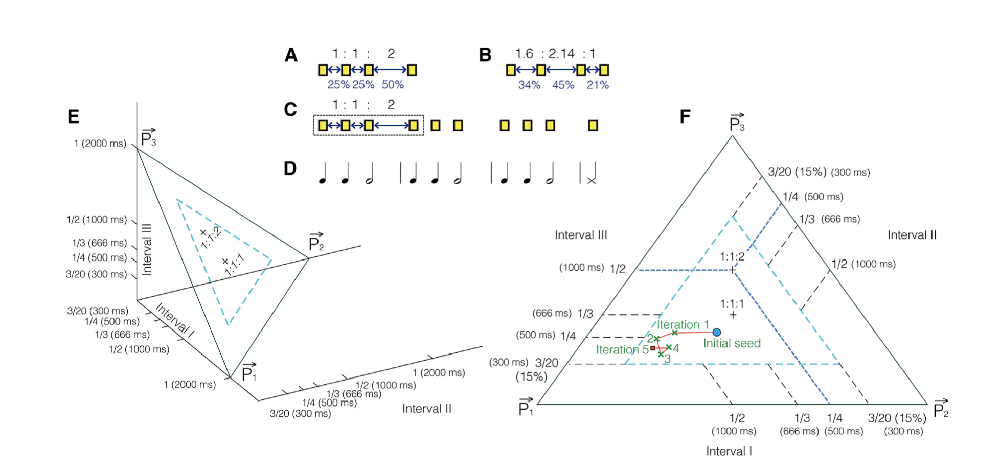
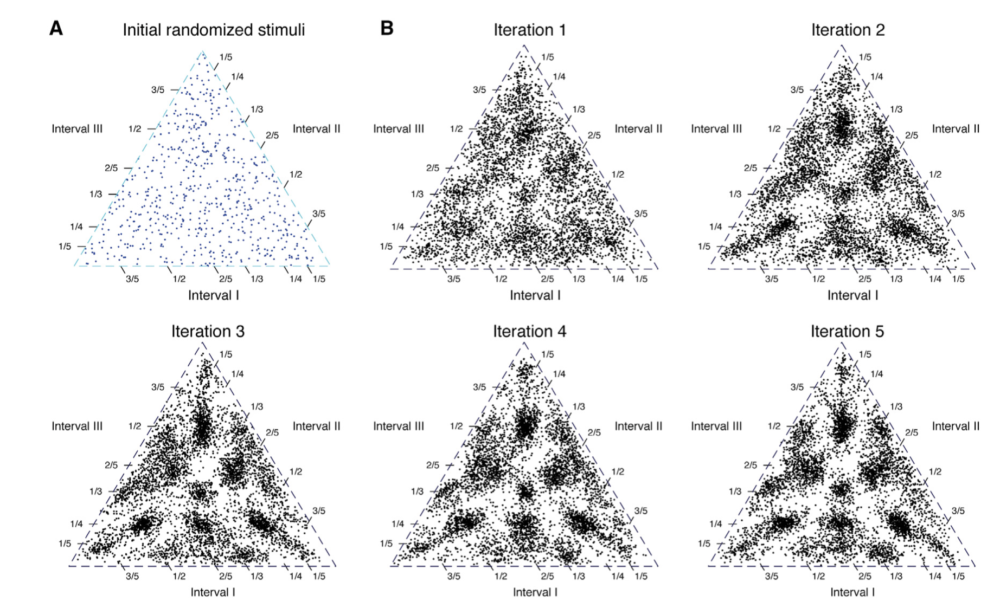
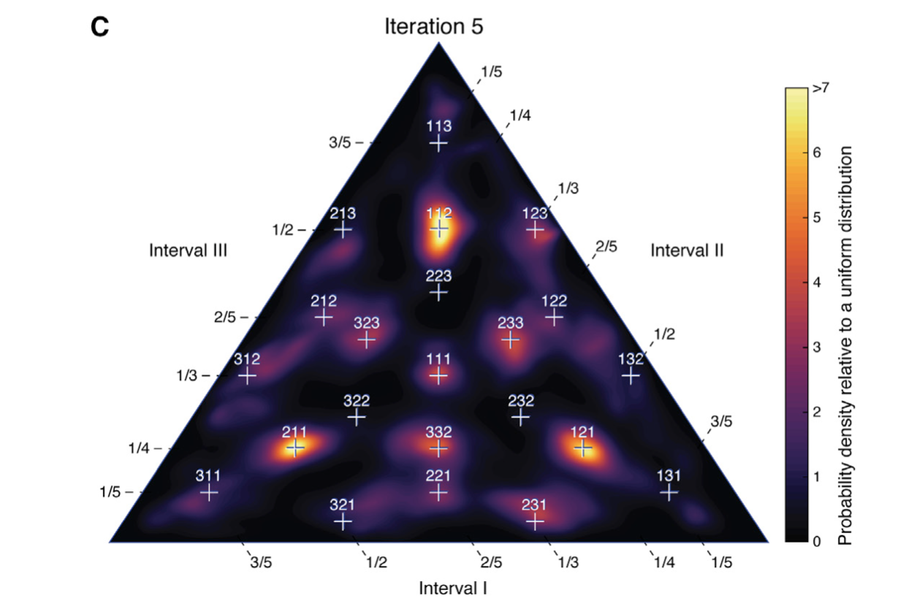

# Rytm

---

# Pojęcia

* Częstotliwość (frequency)
* Faza (phase)
* Izochroniczność (isochronicity)

---

# Jak przetwarzają rytm systemy biologiczne

* Motor periodicity
* Beat extraction
* Audiomotor entrainment
* Meter

---

# Rytm w muzyce

* Muzyka jest zadziwiająco izochroniczna (choć nie zawsze)
* Jest to pewnie potrzebne, żeby grać razem
* _Beat extraction_ czasem jest bardzo trudne (periodyczność jest nieoczywista, niewidoczna w fali akustycznej)
* _Meter_ jest jeszcze trudniejsze i nieoczywiste

---

---

# W mowie

* Dźwięki pojawiają się rytmicznie, ale często nie izochronicznie (częstotliwość przyspiesza i zwalnia)
* Rytm determinuje _akcentowanie_, które jest ważne dla rozumienia mowy
* Mowa może być bardzo izochroniczna (poezja, rap) albo niezbyt izochroniczna

---

# Analiza rytmu

* IOI - inter-onset-interval
* Np. IOI  = 500ms, 2Hz, 120BPM
* Ratios - proporcje IOI pomiędzy kolejnymi zdarzeniami rytmicznymi
* Np. z ratio 1:2 daje trzydźwiękowy rytm o przykładowych IOI 250ms + 500ms

---

# Mapy chronotopologiczne

(Honing, H. _Structure and Interpretation of Rhythm in Music_ W: Deutsch, D. Psychology of Music, Academic Press 2013)

---

(Honing, H. _Structure and Interpretation of Rhythm in Music_ W: Deutsch, D. Psychology of Music, Academic Press 2013)

---

# Ludzie mają preferencje integer ratios (Jacoby, McDermott, 2017)

* Klasyczny paradygmat - pukaj palcem do rytmu
* Początkowy rytm (czterodźwiękowy) miał losowe ratio (_initial seed_)
* W trakcie kolejnych powtórzeń ludzie coraz bardziej "ciągną"
w kierunku całkowitych proporcji (integer ratios), np. 1:2:1, 2:1:1, 1:3:1 itd.
* Efekt obecny (mimo kilku rozbieżności) u ludzi z USA i rdzennych mieszkańców Amazonii

---

(Jacoby & McDermott, 2017, Curr Biol)

---

(Jacoby & McDermott, 2017, Curr Biol)

---

(Jacoby & McDermott, 2017, Curr Biol)

---

# Jak to jest z rytmem u zwierząt?

---

# Ronan the Sea Lion

<https://www.youtube.com/watch?v=6yS6qU_w3JQ>

---

# 